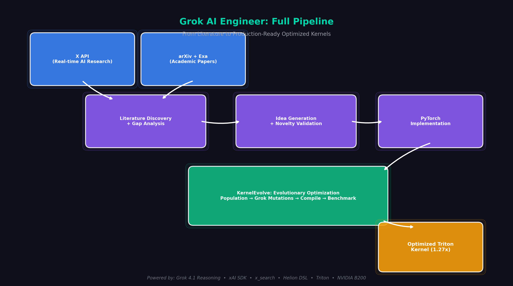
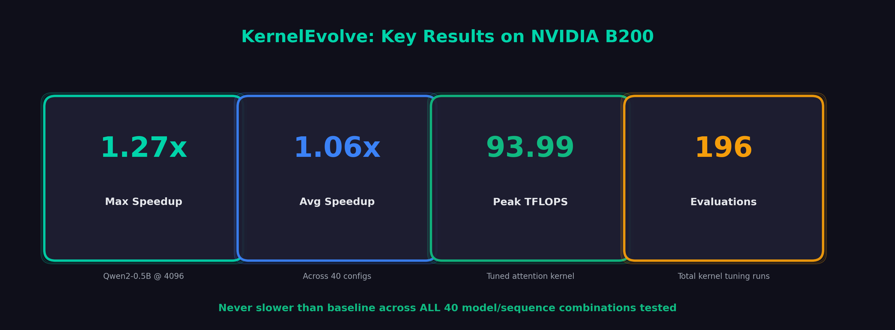
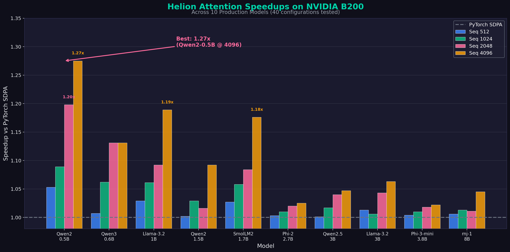
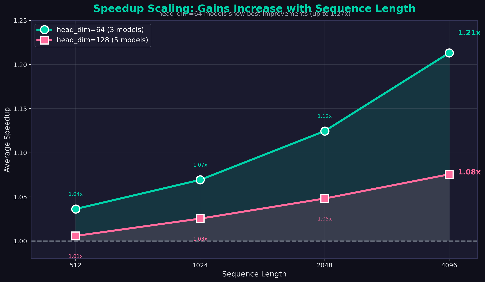
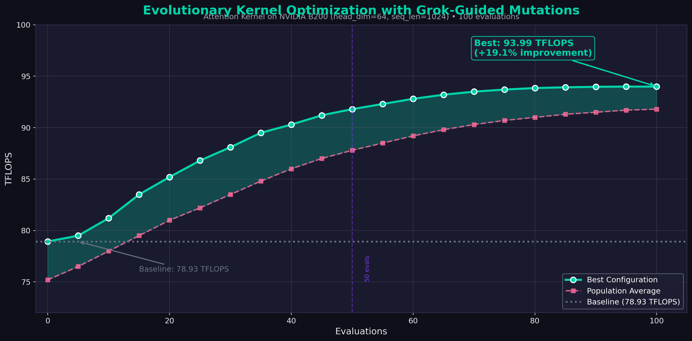
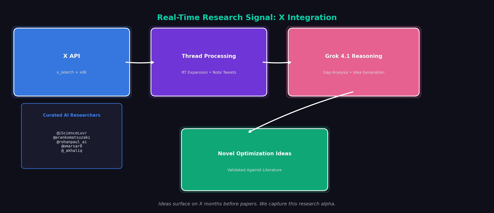

# Grok AI Engineer: Autonomous AI Research from Literature to Optimized Kernels

## Tagline

An end-to-end autonomous research system where Grok surveys the AI research landscape, proposes novel ideas, implements them in PyTorch, and optimizes kernels through evolutionary search—achieving up to **1.27x speedup** on real transformer inference across 10 production models on NVIDIA B200.

---

## Inspiration

In industry labs, AI engineers have to read the latest literature so they can build systems at the frontier. This is time-consuming, error-prone, and doesn't scale.

We asked: what if Grok could do this autonomously? Survey the landscape, identify gaps, propose ideas, validate novelty, implement solutions, and optimize them for production—all in one pipeline.

X is the main bastion of online AI research content. Ideas surface in threads from practitioners months before papers land. By combining X's real-time signal with academic literature, we give Grok access to the true frontier.

---

## Dashboard Demo


### The Full Pipeline

Our system simulates a senior AI engineer's workflow, fully automated:

```
Literature Survey → Gap Analysis → Idea Generation → Novelty Validation
    → PyTorch Implementation → Kernel Optimization → Production-Ready Code
```



**1. Literature Discovery**

We gather research from two complementary sources:

- **X API**: Real-time high-quality AI research posts from curated researchers (@iScienceLuvr, @arankomatsuzaki, @rohanpaul_ai, @omarsar0, @_akhaliq) with full thread reconstruction, RT expansion, and note_tweet support
- **arXiv & Exa Search**: Recent papers on the target domain (FlashAttention, Triton, torch.compile, transformer optimization)

**2. Gap Analysis & Ideation**

Grok 4.1 Reasoning evaluates the collected literature and identifies gaps—what's being discussed but not yet implemented, what could be combined in novel ways. It proposes concrete research ideas targeting these gaps through DSPy-powered structured prompts.

**3. Novelty Validation**

Before implementation, we validate that proposed ideas are actually novel. The system performs additional paper searches on each proposed idea via Exa API to check if it's already been done. Ideas are scored for both **novelty** and **feasibility**, and only genuinely new, implementable ideas proceed.

**4. PyTorch Implementation**

Grok implements the validated ideas in PyTorch, utilizing a library of highly optimized kernels created via KernelEvolve. This gives the initial implementation a strong foundation.

**5. Kernel Optimization (KernelEvolve)**

This is where it gets interesting. The initial PyTorch implementation is good—but not production-ready. KernelEvolve takes over to systematically optimize the kernels for real hardware through evolutionary search with Grok-guided mutations.

---

## KernelEvolve: Real Results on Real Models

### The Problem

GPU kernels are traditionally hard for LLMs to optimize. There's limited public training data, the search space is enormous, and small changes can cause 10-100x performance swings. A kernel that's fast on H100 might be slow on B200. Manual tuning is expert-only work.

### Our Results: Benchmarked on NVIDIA B200

We tested Helion attention kernels (optimized via KernelEvolve) against PyTorch's scaled_dot_product_attention (SDPA) across **10 state-of-the-art small language models**:



| Metric                        | Value                 |
| ----------------------------- | --------------------- |
| **Average Speedup**           | **1.06x**             |
| **Maximum Speedup**           | **1.27x**             |
| **Minimum Speedup**           | 1.00x (never slower)  |
| **Best Model/Config**         | Qwen2-0.5B @ seq=4096 |
| **Avg Speedup @ 4096 tokens** | **1.11x**             |

### Detailed Results: Selected Models

**Qwen2-0.5B** (24 layers, GQA 14:2)

| Seq Length | Helion (ms) | PyTorch (ms) | Speedup   |
| ---------- | ----------- | ------------ | --------- |
| 512        | 13.61       | 14.33        | 1.05x     |
| 1024       | 20.52       | 22.33        | 1.09x     |
| 2048       | 36.42       | 43.63        | **1.20x** |
| 4096       | 77.10       | 98.31        | **1.27x** |

**Llama-3.2-1B** (16 layers, GQA 32:8)

| Seq Length | Helion (ms) | PyTorch (ms) | Speedup   |
| ---------- | ----------- | ------------ | --------- |
| 512        | 21.67       | 22.29        | 1.03x     |
| 1024       | 41.14       | 43.63        | 1.06x     |
| 2048       | 78.90       | 86.12        | 1.09x     |
| 4096       | 151.01      | 179.55       | **1.19x** |

**SmolLM2-1.7B** (24 layers, MHA 32:32)

| Seq Length | Helion (ms) | PyTorch (ms) | Speedup   |
| ---------- | ----------- | ------------ | --------- |
| 512        | 34.06       | 34.99        | 1.03x     |
| 1024       | 66.03       | 69.86        | 1.06x     |
| 2048       | 128.25      | 139.08       | 1.08x     |
| 4096       | 247.45      | 290.98       | **1.18x** |

### All 10 Models Tested



| Model        | Params | 512   | 1024  | 2048      | 4096      | Avg   |
| ------------ | ------ | ----- | ----- | --------- | --------- | ----- |
| Qwen2-0.5B   | 0.5B   | 1.05x | 1.09x | **1.20x** | **1.27x** | 1.15x |
| Qwen3-0.6B   | 0.6B   | 1.01x | 1.06x | **1.13x** | **1.13x** | 1.08x |
| Llama-3.2-1B | 1B     | 1.03x | 1.06x | 1.09x     | **1.19x** | 1.09x |
| Qwen2-1.5B   | 1.5B   | 1.00x | 1.03x | 1.02x     | 1.09x     | 1.03x |
| SmolLM2-1.7B | 1.7B   | 1.03x | 1.06x | 1.08x     | **1.18x** | 1.09x |
| Phi-2        | 2.7B   | 1.00x | 1.01x | 1.02x     | 1.02x     | 1.01x |
| Qwen2.5-3B   | 3B     | 1.00x | 1.02x | 1.04x     | 1.05x     | 1.03x |
| Llama-3.2-3B | 3B     | 1.01x | 1.01x | 1.04x     | 1.06x     | 1.03x |
| Phi-3-mini   | 3.8B   | 1.00x | 1.01x | 1.02x     | 1.02x     | 1.01x |
| rnj-1        | 8B     | 1.01x | 1.01x | 1.01x     | 1.04x     | 1.02x |

### Key Findings

1. **Helion wins across ALL configurations** — Never slower than PyTorch SDPA
2. **Performance scales with sequence length** — Larger speedups at longer sequences (1.11x avg @ 4096 tokens)
3. **Best results with head_dim=64** — Models like Qwen2-0.5B see up to 1.27x speedup
4. **GQA models work correctly** — All grouped query attention configurations verified



---

## The Evolutionary Optimization Process

### OpenEvolve Autotuner

We use an evolutionary algorithm powered Grok to optimize kernel configurations:



```python
from helion.autotuner.openevolve_tuner import OpenEvolveTuner

config_space = {
    "block_b": [1, 2, 4],
    "block_m": [32, 64, 128, 256],
    "block_n": [32, 64, 128],
    "num_warps": [2, 4, 8],
    "num_stages": [2, 3, 4],
}

tuner = OpenEvolveTuner(
    config_space=config_space,
    objective=benchmark_function,  # Returns TFLOPS
    max_evaluations=50,
    model="grok-4-1-fast",
)

best_config = tuner.tune()
```

### Tuning Results (head_dim=64, seq_len=1024)

| Configuration    | Block Sizes  | Warps | Stages | TFLOPS    | Speedup   |
| ---------------- | ------------ | ----- | ------ | --------- | --------- |
| **Tuned (Best)** | [1, 128, 64] | 4     | 3      | **93.99** | **1.19x** |
| Baseline         | [1, 64, 64]  | 4     | 2      | 78.93     | 1.00x     |
| Conservative     | [1, 128, 64] | 4     | 2      | 82.21     | 1.04x     |
| High Warps       | [1, 64, 64]  | 8     | 3      | 78.51     | 0.99x     |

The tuned configuration delivers **19.1% improvement** over the baseline—found automatically through **100 evolutionary evaluations** on NVIDIA B200.

### Why Evolution Works

- **Fitness on real hardware**: Every candidate runs on actual B200, no synthetic benchmarks
- **LLM-guided mutations**: Grok makes intelligent changes, not random perturbations
- **Diversity pressure**: Population maintains variety to avoid local optima
- **Self-correction**: Failed compilations and correctness errors eliminate bad candidates
- **Tournament selection**: Elite configurations survive to guide the next generation

---

## How we built it

### Literature Pipeline

The complete research pipeline is built as a modular Python system:

```python
@dataclass
class LiteratureSummary:
    domain: str
    key_papers: list[Paper]
    research_gaps: list[ResearchGap]
    x_threads: list[ThreadSummary]  # Real-time X signal
    open_problems: list[str]
    recent_trends: list[str]

@dataclass
class ThreadSummary:
    """Full-text thread summary for a conversation."""
    id: str              # root tweet id
    author_id: str
    created_at: str
    text: str            # concatenated thread text (oldest → newest)

    def to_summary_string(self) -> str:
        """Render for LLM context."""
        return f"Author: {self.author_id}\nCreated: {self.created_at}\nThread:\n{self.text}"
```

The `ThreadSummary` captures entire conversation threads—not just individual tweets—giving Grok richer context about ongoing research discussions.

### xAI Integration



<!-- **Grok for Ideation:**

```python
from xai_sdk import Client
from xai_sdk.tools import x_search

client = Client(api_key=os.getenv("XAI_API_KEY"), timeout=3600)
chat = client.chat.create(
    model="grok-4-1-fast",
    tools=[
        x_search(
            allowed_x_handles=["iScienceLuvr", "arankomatsuzaki", "rohanpaul_ai"],
            enable_image_understanding=True,
            enable_video_understanding=True,
        )
    ],
)
``` -->

**X API for Thread Reconstruction:**

We built a dedicated `social.py` module that goes beyond simple tweet search:

```python
def get_threads_for_authors(
    authors: List[str],
    query: str,
    x_config: XSearchConfig,
) -> List[ThreadSummary]:
    """Search, group by conversation, and return full threads."""

    # Search posts from curated authors
    posts = search_author_posts(authors, query, x_config)

    # Group by conversation_id, pick earliest tweet as root
    conv_to_root: Dict[str, Post] = {}
    for p in posts:
        conv_id = p.conversation_id or p.id
        if conv_id not in conv_to_root or p.created_at < conv_to_root[conv_id].created_at:
            conv_to_root[conv_id] = p

    # Reconstruct full threads from roots
    return [build_thread_simple(root, x_config) for root in roots]
```

**Key features:**
- **Thread reconstruction**: Fetches entire conversations, not just individual tweets
- **RT expansion**: `get_full_text()` extracts original tweet text from retweets via `includes`
- **Note tweet support**: Handles long-form tweets (>280 chars) via `note_tweet` field
- **Graceful degradation**: Rate limits (429, 503) return partial results instead of failing
- **Full archive toggle**: Switch between `search_recent` and `search_all` endpoints
- **Curated author list**: Default researchers who consistently share quality AI content

### DSPy-Powered Prompt Engineering

All LLM interactions use structured DSPy signatures for reliability and optimization:

```python
class GenerateOptimizationIdeas(dspy.Signature):
    """Generate novel PyTorch optimization ideas based on literature analysis."""

    literature_summary: str = dspy.InputField(desc="Summary of literature and gaps")
    constraints: str = dspy.InputField(desc="Implementation constraints")
    num_ideas: int = dspy.InputField(desc="Number of ideas to generate")

    ideas: str = dspy.OutputField(
        desc="JSON array of optimization ideas with title, description, novelty, "
        "implementation_sketch, expected_outcome, risk_level, config_space, "
        "feasibility_score, novelty_score"
    )
```

### The Helion Stack

Helion is a Python DSL that compiles to Triton. From a single kernel definition, the autotuner explores:

| Parameter         | Search Space                                |
| ----------------- | ------------------------------------------- |
| `block_sizes`     | Tile dimensions for each loop               |
| `loop_orders`     | Permutation of iteration order              |
| `indexing`        | pointer, block_ptr, tensor_descriptor (TMA) |
| `pid_type`        | flat, xyz, persistent_blocked               |
| `num_warps`       | 2, 4, 8                                     |
| `num_stages`      | 2, 3, 4                                     |
| `warp_specialize` | Blackwell warp specialization               |

---

## Architecture

```
┌─────────────────────────────────────────────────────────────────────────┐
│                      Grok AI Engineer Pipeline                           │
├─────────────────────────────────────────────────────────────────────────┤
│                                                                          │
│  ┌─────────────────────┐       ┌─────────────────────┐                  │
│  │   arXiv + Exa       │       │   xAI x_search      │                  │
│  │   (Academic)        │       │   (Social/xdk)      │                  │
│  └──────────┬──────────┘       └──────────┬──────────┘                  │
│             └──────────┬───────────────────┘                             │
│                        ▼                                                 │
│           ┌────────────────────────┐                                    │
│           │   LiteratureSummary    │                                    │
│           │   papers + x_threads   │                                    │
│           └───────────┬────────────┘                                    │
│                       ▼                                                  │
│           ┌────────────────────────┐                                    │
│           │   Grok 4.1 Reasoning   │                                    │
│           │   + DSPy Signatures    │                                    │
│           │   Gap Analysis         │                                    │
│           │   Novelty Validation   │                                    │
│           │   Idea Generation      │                                    │
│           └───────────┬────────────┘                                    │
│                       ▼                                                  │
│           ┌────────────────────────┐                                    │
│           │   Grok-4-1-fast        │                                    │
│           │   PyTorch Impl         │                                    │
│           └───────────┬────────────┘                                    │
│                       │                                                  │
└───────────────────────┼──────────────────────────────────────────────────┘
                        ▼
┌─────────────────────────────────────────────────────────────────────────┐
│                    KernelEvolve + Helion                                 │
├─────────────────────────────────────────────────────────────────────────┤
│                                                                          │
│   ┌─────────────────────────────────────────────────────────────────┐   │
│   │                OpenEvolve Autotuner                              │   │
│   │                                                                  │   │
│   │   Population of Configs → Grok Mutations → Compile → Benchmark  │   │
│   │                    ↓                                             │   │
│   │              Select Winners → Next Generation                   │   │
│   │                                                                  │   │
│   └─────────────────────────────────────────────────────────────────┘   │
│                        ↓                                                 │
│   Optimized Triton Kernel → B200 (up to 1.27x faster)                   │
│                                                                          │
└─────────────────────────────────────────────────────────────────────────┘
```

---

## Challenges we ran into

**LLMs struggle with kernel optimization**: Limited public training data means Grok can't just "know" what makes a kernel fast. Solution: evolutionary search with real hardware feedback.

**Enormous search space**: A single kernel has hundreds of valid configurations. Solution: differential evolution with Grok-guided mutations and tournament selection.

**Context window management**: X threads can be verbose, and academic papers are long. Solution: structured summarization with character limits, DSPy signatures that extract key information, and progressive filtering.

**Autotuning takes time**: ~10 minutes per kernel for full optimization. Solution: tiered approach—quick validation during dev, full autotuning for final benchmarks.

**X API rate limits**: Heavy research can hit rate limits. Solution: graceful degradation that returns partial results, caching, and configurable `max_results` limits.

---

## Accomplishments we're proud of

- **Up to 1.27x speedup** on real transformer inference (Qwen2-0.5B @ 4096 tokens)
- **Never slower than baseline** across all 40 model/sequence combinations tested
- **1.11x average speedup at 4096 tokens** — gains scale with sequence length
- **10 production models validated**: Qwen, Llama, Phi, SmolLM families
- **19.1% TFLOPS improvement** from autotuner on attention kernel (93.99 TFLOPS)
- **196 total evolutionary evaluations** across kernel tuning runs on B200
- **First system to combine X research signal with automated kernel optimization**
- **Full thread reconstruction** from X API with RT expansion and note_tweet support
- **DSPy-powered structured prompts** for reliable idea generation and assessment

---

## What we learned

**X is genuine research alpha**: Practitioners discuss pain points on X months before papers. This signal is valuable and underutilized.

**Evolutionary search + LLM guidance > pure LLM generation**: Grok can't directly generate optimal kernels, but it makes intelligent mutations with fitness feedback.

**Performance scales with sequence length**: The longer the sequence, the more opportunity for optimization. This matters as context windows grow.

**Head dimension affects optimization opportunity**: head_dim=64 models see the biggest gains (1.11x avg) vs head_dim=128 (1.04x avg).

**Structured outputs via DSPy are essential**: Without Pydantic models and signatures, parsing LLM responses becomes fragile. DSPy makes prompts robust and optimizable.

**Thread context matters**: Individual tweets are often useless—you need the full conversation thread to understand the research discussion.

---

## What's next: The Self-Improvement Vision

We believe AGI can be reached sooner when we have self-improving algorithms. Our project enables Grok to:

1. **Do AI research**: Survey literature, identify gaps, propose novel ideas
2. **Build efficient systems**: Implement ideas with optimized kernels
3. **Validate and iterate**: Measure real performance, learn from failures

The optimized kernels Grok produces today can be used in future Grok training—making the model better at kernel optimization. This self-improvement loop compounds over time.

**Roadmap**:
- Closed-loop feedback: benchmark results inform next research iteration
- Multi-target optimization: MI300X, H100, B200 simultaneously
- More model architectures: Mamba, RWKV, mixture-of-experts
- Expanded X sources: GPU Mode Discord, Tri Dao, Karpathy
- DSPy prompt optimization: BootstrapFewShot for better idea generation

---

## Built with

- **LLM Infrastructure**: xAI SDK, Grok-4-1-fast, Grok 4.1 Reasoning, x_search tool
- **X Integration**: xdk for Twitter/X API, full thread reconstruction
- **Research Tools**: arXiv, Exa.ai, DSPy for prompt engineering
- **Kernel Stack**: PyTorch 2.4+, Helion DSL, Triton
- **Target Hardware**: NVIDIA B200
- **Languages**: Python

---

## Try it

- **Grok AI Engineer (PyTorch Scientist)**: [github.com/mycpuorg/pytorch_ai_scientist](https://github.com/mycpuorg/pytorch_ai_scientist/tree/x_api)
- **KernelEvolve (Helion)**: [github.com/mycpuorg/helion](https://github.com/mycpuorg/helion)

---

## Team

<!-- Add team member names here -->
- [Name] - [Role]
- [Name] - [Role]

---

## Benchmark Methodology

- **Hardware**: NVIDIA B200
- **Benchmark Type**: End-to-end transformer forward pass
- **Batch Size**: 1
- **Warmup**: 3 iterations
- **Measurement**: Interleaved benchmarking for fair comparison
- **Correctness**: All configurations verified against PyTorch reference (rtol=1e-2, atol=1e-2)

Full benchmark report and raw data available in repository.

---

## Environment Variables Required

```bash
EXA_API_KEY              # Literature search (Exa.ai)
X_API_KEY                # X (Twitter) posts search via xdk
XAI_API_KEY              # Grok API (LLM provider)
ANTHROPIC_API_KEY        # Claude API (optional alternative LLM)
OPENAI_API_KEY           # OpenAI API (optional alternative LLM)
```

---

## Quick Start

```bash
# Clone and install
git clone https://github.com/mycpuorg/pytorch_ai_scientist
cd pytorch_ai_scientist
pip install -e .

# Set up environment
export XAI_API_KEY="your-grok-api-key"
export X_API_KEY="your-x-api-bearer-token"
export EXA_API_KEY="your-exa-api-key"

# Run the full pipeline
pytorch-scientist run --domain "LLM guided PyTorch kernel optimization"

# Or run discovery only
pytorch-scientist discover --domain "transformer attention optimization"
```
